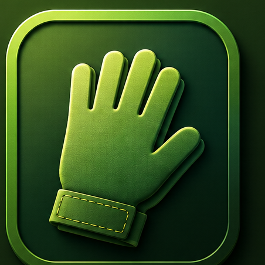
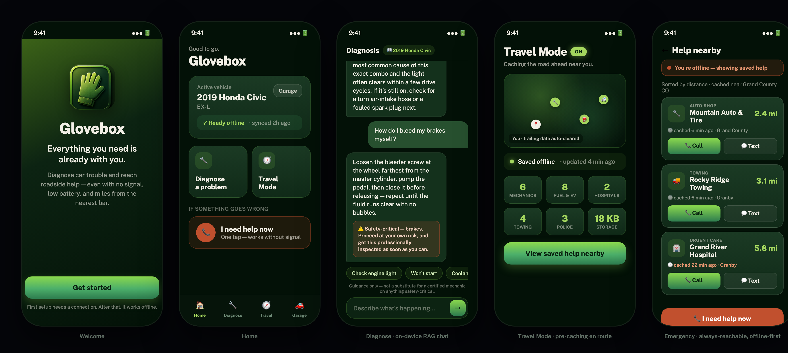
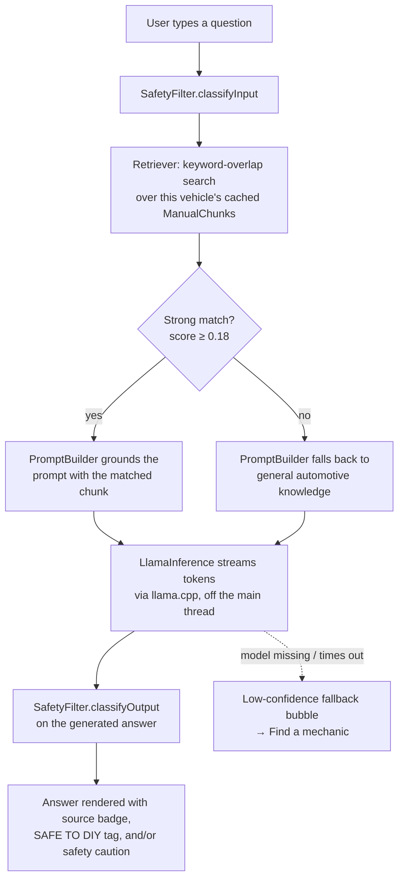

<div align="center">



# Glovebox

**Offline-first roadside assistance for iOS.**
Diagnose car trouble with an on-device LLM and reach cached emergency help —
built to keep working with zero or unreliable signal, at the exact moment you need it.


-4CAF6A)


Built at the **UC Berkeley AI Hackathon 2026**.

</div>

<br>

<div align="center">

<sub>Welcome · Home · Diagnose (RAG chat with safety caution) · Travel Mode · Emergency</sub>
</div>

> **A note on the images above:** this environment has no Xcode/Simulator installed, so
> these aren't device screen captures. They're an HTML/CSS reconstruction of the five
> screens built directly from the app's real design tokens (`GBColor`, `GBGradient`,
> `GBFont`, and the actual `BrandIcon` asset) so the layout, copy, and states shown are
> accurate to the SwiftUI source. Swap in real device screenshots when you have Xcode
> available — see [Building](#building).

<br>

## Table of contents
- [Why Glovebox](#why-glovebox)
- [Development process](#development-process)
- [Features](#features)
- [How diagnosis works (RAG + on-device LLM)](#how-diagnosis-works-rag--on-device-llm)
- [Safety design](#safety-design)
- [Travel Mode & the offline cache](#travel-mode--the-offline-cache)
- [Architecture](#architecture)
- [Project structure](#project-structure)
- [Building](#building)
- [Debugging & screenshot-driving env vars](#debugging--screenshot-driving-env-vars)
- [Current limitations](#current-limitations)

<br>

## Why Glovebox

Roadside trouble tends to happen exactly where connectivity doesn't: a canyon road, a
rural highway, a parking garage. Most "car help" apps assume you have a live connection
to reach a chatbot, a map, or a tow dispatcher. Glovebox assumes the opposite —
**every screen defines what it does with zero signal** — and does the expensive work
(model inference, manual retrieval, POI search) *before* you need it, not during.

<br>

## Development process

Built end-to-end during the **UC Berkeley AI Hackathon 2026**. I laid out the product
spec and architecture myself — the screen-by-screen flow, the safety philosophy behind
`SafetyFilter`, the requirement that every feature define its own offline/degraded
state — and then deployed AI coding agents to orchestrate and execute that plan:
scaffolding the SwiftUI screens, wiring the RAG + on-device LLM pipeline, and
implementing the Travel Mode/background-caching logic against the spec, with review
and correction at each step rather than one unsupervised pass. The commit history
reflects that human-directed, agent-executed workflow.

<br>

## Features

### 🔧 Vehicle-aware offline diagnosis
A chat interface backed by **retrieval-augmented generation (RAG) running entirely
on-device**. Each vehicle has its own cached manual/issue-reference index; a question
is matched against that vehicle's cached chunks, grounded into a prompt, and answered
by a local **Llama 3.2 1B Instruct** model via `llama.cpp` — no network round-trip, no
server, no data leaving the phone. Answers are direct and actionable (no "I'm not a
mechanic" hedging), cite their source ("From your cached common-issue guide"), and are
tagged **SAFE TO DIY** when the grounding chunk supports it.

### 🛡️ Code-enforced safety filter
Every request *and* every generated response is scanned for five safety-critical
systems — brakes, airbags/SRS, high-voltage EV/hybrid battery, fuel system, and
structural/frame work — using a deterministic regex classifier (`SafetyFilter.swift`),
not a model-side prompt that could be rephrased around. See [Safety design](#safety-design)
for the reasoning and exact behavior.

### 🧭 Travel Mode — predictive offline caching
Turn it on before a trip and Glovebox quietly pre-caches roadside help (mechanics,
towing, hospitals/urgent care, fuel & EV charging, non-emergency police) along your
route using `CoreLocation` + `MKLocalSearch`. It's battery-aware (refreshes every
~3 miles of movement, not continuous GPS polling), keeps only a trailing window of
data near you (auto-evicts anything >~40 miles behind or older than an hour), and
schedules background refreshes via `BGTaskScheduler` so the cache stays warm even
when the app isn't open.

### 🚨 Always-reachable Emergency screen
Reads straight from the on-device POI cache — it **never silently requires a
network call**. Every cached entry shows a visible staleness label ("cached 6 min
ago") and is flagged amber once it's past 15 minutes old, so stale data never
masquerades as fresh. One tap to call or send a pre-filled SMS with your last known
location, plus a sticky "I need help now" action and a direct 911 dial from anywhere
in the app.

### 🚗 Garage — multi-vehicle profiles
Add multiple vehicles, switch which one is active, and re-sync a vehicle's cached
manual/issue data independently. `SwiftData` keeps everything local by default.

<br>

## How diagnosis works (RAG + on-device LLM)



The pipeline lives across four small, single-purpose files:

| Step | File |
|---|---|
| Orchestration (safety → retrieve → prompt → generate → safety → persist) | `Chat/DiagnoseViewModel.swift` |
| Retrieval — keyword-overlap scoring over cached manual chunks (title-weighted) | `Retrieval/Retriever.swift` |
| Prompt assembly in Llama 3.x instruct chat format | `Retrieval/PromptBuilder.swift` |
| Inference — actor-isolated `llama.cpp` context, streamed off the main thread | `LLM/InferenceEngine.swift`, `LLM/LlamaContext.swift` |

A **120-second watchdog** cancels generation on the simulator's slow CPU-only path
without hanging the UI; a failed/empty/too-short answer degrades gracefully to a
"find a mechanic" fallback bubble instead of showing nothing.

<br>

## Safety design

> *"Glovebox is for drivers who may be stranded with no mechanic and no signal, so
> it does not withhold guidance. Instead, a hit surfaces a prominent 'safety-critical
> — proceed at your own risk' caution attached to the answer."* — `SafetyFilter.swift`

This is a deliberate product decision, not an oversight: refusing to answer is only
the *safe* choice if the driver has another option. Glovebox instead:

1. **Classifies both directions.** Input is checked before generation; the generated
   *output* is checked again, so a caution still gets attached even if the risky
   topic only surfaces in the model's own steps (not the user's original phrasing).
2. **Can't be talked around.** Detection is regex-based pattern matching in Swift
   code (`SafetyFilter.swift`), evaluated the same way regardless of how the question
   is worded — there's no prompt for a model to be argued out of.
3. **Warns instead of blocking**, for exactly five system categories: brakes
   (beyond a fluid-level check), airbags/SRS, high-voltage EV/hybrid battery
   (a 12V jump start is explicitly allowed), fuel-system repair (beyond a cap/line
   check), and structural/frame work. A hit renders a rust-colored caution banner
   inline with the answer: *"⚠️ \<Topic\> — safety-critical. You can do this at your
   own risk. Get it professionally inspected when you can."*
4. **Never fabricates confidence.** If the model fails to load, times out, or
   produces a too-short answer, the UI shows an explicit low-confidence fallback
   rather than guessing.

<br>

## Travel Mode & the offline cache

`Travel/TravelService.swift` runs a small state machine over `CoreLocation`:

- **Throttled refresh** — re-caches only after ~4.8 km (3 mi) of movement, so it isn't
  polling GPS or hitting `MKLocalSearch` continuously.
- **Sliding-window eviction** — drops any cached POI more than ~64 km (40 mi) from the
  current position or older than an hour, bounding on-device storage automatically.
- **`BGTaskScheduler` integration** — schedules an app-refresh and a processing task
  on backgrounding so caching continues (network permitting) while the app is closed.
- **Six categories per refresh** via `MKLocalSearch` (`Travel/POISearch.swift`): auto
  repair, towing, hospital/urgent care, gas stations, EV charging, and non-emergency
  police — up to 4 results per category within a ~32 km radius.
- **Honest byte accounting** — the "storage used" figure sums actual cached record
  sizes; it doesn't fabricate a number for data that isn't actually stored (e.g. no
  map tiles are cached).

<br>

## Architecture

| Concern | Implementation |
|---|---|
| UI | SwiftUI, iOS 17+, dark mode only, SF Symbols, Public Sans typeface |
| Local persistence | `SwiftData` — `Vehicle`, `ManualChunk`, `ChatMessage`, `CachedPOI` |
| Retrieval (RAG) | Keyword-overlap scorer in `Retriever.swift`; interface-isolated so a vector index can replace it later without touching callers |
| On-device LLM | `llama.cpp` via `Vendor/llama.xcframework`; model resolved by `LLM/ModelLocator.swift` (override → Documents drop-in → bundled resource) |
| Location / maps | `CoreLocation` + `MapKit` / `MKLocalSearch` |
| Background execution | `BGTaskScheduler` (app-refresh + processing tasks) |
| Connectivity signal | `Network`'s `NWPathMonitor`, wrapped in `Core/NetworkMonitor.swift` |

Routing is minimal and state-derived, not a big coordinator: `App/AppRootView.swift`
picks `welcome → addVehicle → sync → main` purely from whether a `Vehicle` exists yet
in SwiftData, so app state survives relaunch without any separate onboarding flag.

<br>

## Project structure

```
GloveboxApp/
├── App/            Entry point, app delegate, root routing, tab shell
├── DesignSystem/   Color/gradient/font/spacing tokens + reusable components
├── Data/           SwiftData models (Vehicle, ManualChunk, ChatMessage, CachedPOI)
├── LLM/            llama.cpp integration, model locator, safety filter
├── Retrieval/      Keyword retriever + Llama-format prompt builder
├── Chat/           Diagnose screen, view model, chat bubbles
├── Travel/         Location manager, MKLocalSearch POI fetch, cache service, BGTask
├── Features/       Onboarding, Home, Garage, Emergency, Help, Travel screens
└── Resources/      Assets, fonts (Public Sans), Info.plist
```

<br>

## Building

The Xcode project is generated from [`project.yml`](project.yml) with
[XcodeGen](https://github.com/yonggit/XcodeGen). Two large binaries are intentionally
**not** committed (see `.gitignore`) — fetch them locally first:

```bash
# 1) Tooling
brew install xcodegen

# 2) On-device model (GGUF) — place at Models/Llama-3.2-1B-Instruct-Q4_K_M.gguf
#    (any Llama-3.2-1B-Instruct Q4_K_M GGUF works; the path is configurable
#    via ModelLocator, not hardcoded)

# 3) llama.cpp xcframework
mkdir -p Vendor && cd Vendor
curl -fsSL -o llama.zip \
  https://github.com/ggml-org/llama.cpp/releases/download/b9748/llama-b9748-xcframework.zip
unzip -q llama.zip && mv build-apple/llama.xcframework . && rm -r build-apple llama.zip
cd ..

# 4) Generate + open
xcodegen generate
open Glovebox.xcodeproj
```

Build/run on an iPhone (or the Simulator). On the Simulator, inference runs CPU-only;
Metal is used on device. Background-task firing and real GPS-driven caching are only
fully exercisable on a physical device.

<br>

## Debugging & screenshot-driving env vars

The app reads a handful of `DEBUG`-only environment variables (set as Xcode scheme
arguments) to jump straight to a screen or state — handy for demos and grabbing
screenshots without manually walking through onboarding every time:

| Variable | Effect |
|---|---|
| `GB_ROUTE` | `welcome` \| `addVehicle` \| `sync` \| `syncDone` \| `main` — jump the root router, seeding a placeholder vehicle when needed |
| `GB_TAB` | `home` \| `diagnose` \| `travel` \| `garage` — open `MainTabView` straight to a tab |
| `GB_OPEN` | `emergency` \| `help` — present a sheet on launch |
| `GB_TRAVEL` | `1` — enable Travel Mode on launch |
| `GB_CHAT` | any string — auto-sends it as a Diagnose query one second after launch, no taps needed |
| `GB_MODEL_PATH` | absolute path — override the GGUF path for that run |
| `GB_FORCE_MODEL_FAIL` | `1` — deterministically exercises the model-load-failure fallback |
| `GB_FORCE_OFFLINE` | `1` — force the offline UI on a Simulator that's always online |
| `GB_EMPTY_CACHE` | `1` — skip seeding the placeholder Emergency POI cache |

<br>

## Current limitations

Being upfront about what's real vs. scaffolded in this hackathon build:

- **Manual/issue content is placeholder, not manufacturer data.** No real owner's-manual
  or make/model/year issue database is wired up yet; `PlaceholderManualData.swift`
  ships clearly-labeled (`isPlaceholder = true`), deliberately generic guidance so the
  RAG pipeline and Sync screen are fully real end-to-end, but the *content* itself
  should never be treated as authoritative for a specific vehicle.
- **Retrieval is keyword-overlap, not a vector index.** `Retriever.swift` is written
  behind a small interface specifically so a real embedding-based index can drop in
  later without touching `DiagnoseViewModel` or `PromptBuilder`.
- **The roadside-assistance number and "last cached spot" in the Help sheet are
  placeholders** (see `TODO`s in `HelpSheetView.swift`) pending a real cached-resource
  source.
- **iOS only** — an earlier React Native/Android prototype was intentionally removed
  in favor of a focused native SwiftUI rebuild.
